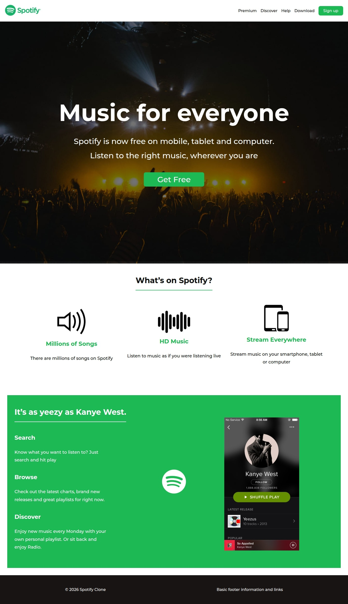
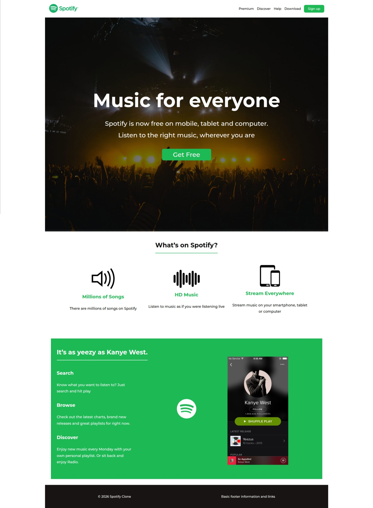
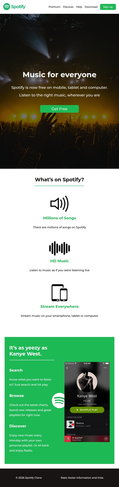
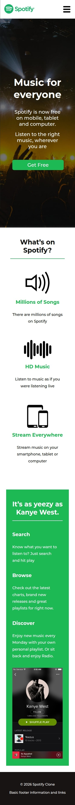
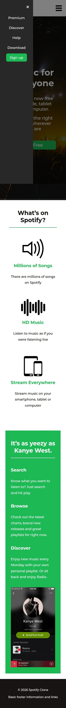

## Descripción del proyecto
Crearion de clon de pàgina de spotify presentada en el pdf en /desigh
desarrollo de versiones phone y tablet

## Capturas de pantalla (móvil y desktop)

## Lo que construí con es una prueba de lo aprendido hasta el momento tratando de hacer lo mejor y mas rapido posible aun sin tener los diseños correspondientes

## Lo que aprendí
el manejo de los display flex, ya que anteriormente no habia trabajado concientemente con esto, es algo que me ha ayudado.

## Lo que mejoraría con más tiempo
finalizaria las secciones de ls enlaces en el footer, generaria un formualrio de registro basico, agregaria mas efectos y animaciones

## URL del proyecto desplegado
https://danielpalmera.github.io/clon-spotify/

https://github.com/danielPalmera/clon-spotify.git
